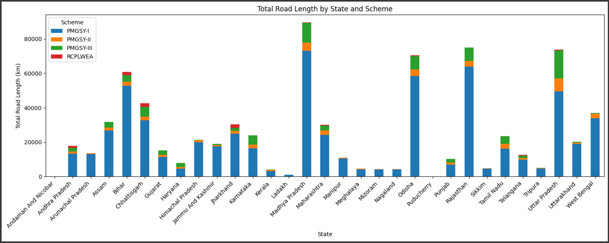
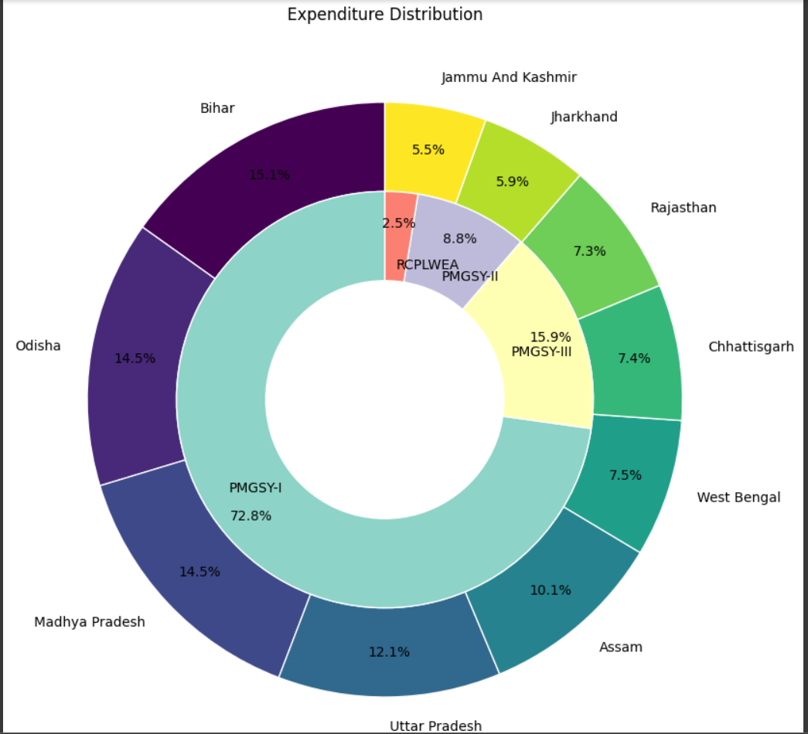
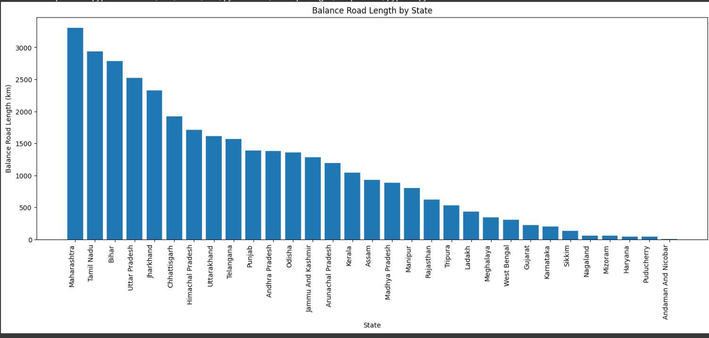
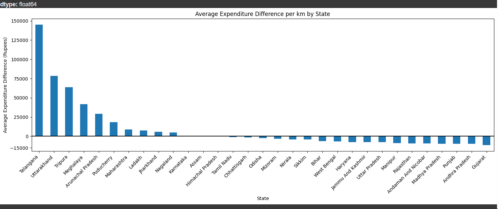
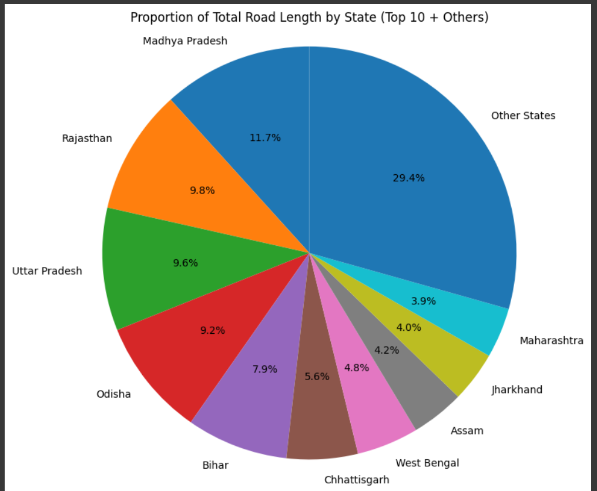
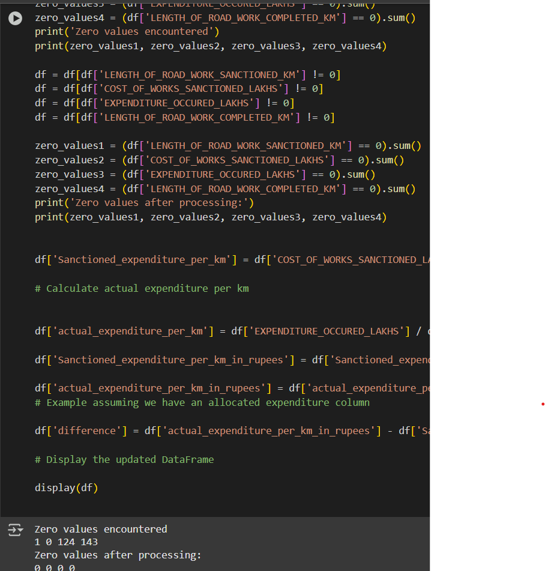

# Analysis of PMGSY Scheme 🛣️

A comprehensive data analysis of India's Pradhan Mantri Gram Sadak Yojana (PMGSY) - a flagship rural road connectivity program aimed at providing all-weather road access to unconnected villages.

## 📊 Project Overview

This project analyzes the performance, expenditure patterns, and regional distribution of the PMGSY scheme across Indian states. The analysis provides insights into road construction progress, cost efficiency, and regional connectivity improvements.

## 🎯 Objectives

- **Performance Analysis**: Evaluate road construction progress across different states
- **Cost Efficiency**: Compare sanctioned vs actual expenditure per kilometer
- **Regional Distribution**: Analyze scheme implementation across states and PMGSY sub-schemes
- **Road Density Analysis**: Calculate road length per square kilometer by state
- **Statistical Testing**: Test hypotheses about relationships between variables

## 📈 Key Findings

### 🏆 Top Performing States
- **Uttar Pradesh**, **Madhya Pradesh**, and **Rajasthan** lead in terms of number of construction projects
- Total coverage: **2,245 construction projects** across the country

### 💰 Expenditure Insights
- Comprehensive analysis of sanctioned vs actual expenditure
- Cost overruns and underruns identified by state
- Average expenditure difference per kilometer calculated

### 🗺️ Regional Analysis
- Road density analysis showing connectivity improvements
- State-wise balance road length remaining
- Proportion of total road length by state

## 🛠️ Technologies Used

- **Python 3.x**
- **Pandas**: Data manipulation and analysis
- **NumPy**: Numerical computations
- **Matplotlib**: Data visualization
- **SciPy**: Statistical analysis
- **Google Colab**: Development environment

## 📁 Dataset Description

The analysis uses two main datasets:

### Primary Dataset (PMGSY.csv)
- `STATE_NAME`: Name of the state
- `PMGSY_SCHEME`: Sub-scheme under PMGSY
- `LENGTH_OF_ROAD_WORK_SANCTIONED_KM`: Sanctioned road length
- `LENGTH_OF_ROAD_WORK_COMPLETED_KM`: Completed road length
- `LENGTH_OF_ROAD_WORK_BALANCE_KM`: Remaining road length
- `COST_OF_WORKS_SANCTIONED_LAKHS`: Sanctioned cost (in lakhs)
- `EXPENDITURE_OCCURED_LAKHS`: Actual expenditure (in lakhs)

### Supporting Dataset (state area.csv)
- `STATE_NAME`: Name of the state
- `AREA_SQ_KM`: Area of the state in square kilometers

## 📊 Visualizations

The project generates several insightful visualizations:

1. **Stacked Bar Chart**: Total road length by state and scheme
  
2. **Nested Pie Chart**: Expenditure distribution (state-wise outer ring, scheme-wise inner ring)
  
3. **Bar Chart**: Balance road length by state
  
4. **Horizontal Bar Chart**: Average expenditure difference per km by state
  
5. **Pie Chart**: Proportion of total road length by top 10 states
  

## 🔍 Analysis Highlights

### Data Preprocessing
- Removed bridge-related columns for focused road analysis
- 
- Filtered out zero values to ensure data quality
- 
- Created derived metrics for per-kilometer analysis

### Key Metrics Calculated
- **Sanctioned expenditure per km**: `COST_OF_WORKS_SANCTIONED_LAKHS / LENGTH_OF_ROAD_WORK_SANCTIONED_KM`
- **Actual expenditure per km**: `EXPENDITURE_OCCURED_LAKHS / LENGTH_OF_ROAD_WORK_COMPLETED_KM`
- **Expenditure difference**: Actual vs Sanctioned expenditure per km
- **Road density**: `LENGTH_OF_ROAD_WORK_COMPLETED_KM / AREA_SQ_KM`

### Statistical Analysis
- **Pearson Correlation Test**: Examining relationship between total road length and state area
- **Hypothesis Testing**: Evaluating significance of relationships between variables

## 🚀 Getting Started

### Prerequisites
```bash
pip install pandas numpy matplotlib scipy
```

### Running the Analysis
1. Clone this repository
```bash
git clone https:/github.com/Abhyansh22/Analysis_PMGSY.git
cd pmgsy-analysis
```

2. Upload your datasets to Google Colab or update file paths
3. Run the Jupyter notebook or Python script

### File Structure
```
pmgsy-analysis/
│
├── Analysis_of_pmgsy.py          # Main analysis script
├── PMGSY.csv                     # Primary dataset
├── state area.csv                # State area dataset
├── README.md                     # This file
└── outputs/                      # Generated CSV files and plots
    ├── scheme_summary.csv
    ├── scheme_expenditure.csv
    ├── total_expenditure.csv
    ├── df_balance.csv
    ├── state_difference.csv
    ├── length_per_sqkm_by_state.csv
    └── state_road_length.csv
```

## 📋 Output Files

The analysis generates several CSV files for further use:
- `scheme_summary.csv`: Road length summary by state and scheme
- `scheme_expenditure.csv`: Expenditure by PMGSY scheme
- `total_expenditure.csv`: Total expenditure by state
- `df_balance.csv`: Balance road length by state
- `state_difference.csv`: Average expenditure difference by state
- `length_per_sqkm_by_state.csv`: Road density by state
- `state_road_length.csv`: Total road length by state

## 🔬 Statistical Findings

### Hypothesis Testing
**H0**: No significant relationship between total road length and state area  
**H1**: Significant relationship exists between total road length and state area

Results from Pearson correlation analysis provide insights into whether larger states tend to have proportionally more road construction under PMGSY.

## 🎨 Key Insights

1. **Regional Focus**: PMGSY shows concentrated efforts in states with larger rural populations
2. **Cost Variations**: Significant variations in per-kilometer costs across states
3. **Completion Rates**: Analysis of completed vs sanctioned road lengths
4. **Efficiency Metrics**: States with better cost management and completion rates identified

## 🤝 Contributing

Contributions are welcome! Please feel free to submit a Pull Request. For major changes, please open an issue first to discuss what you would like to change.


## 🙏 Acknowledgments

- Data sourced from official PMGSY records
- Ministry of Rural Development, Government of India
- Contributors to the rural development sector analysis
